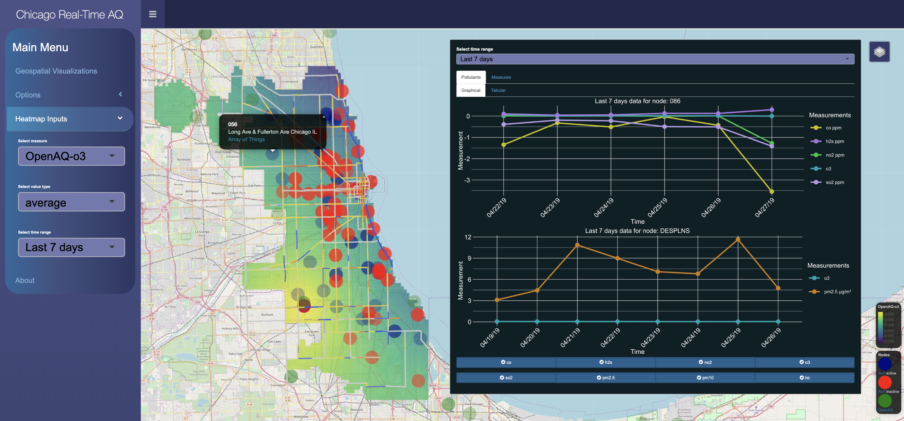

# Chicago Real-time Air Quality

This is the third project repository for the CS 424 Visualization and Visual Analytics class at UIC. It consists in Chicago real-time air quality and weather data visualizations in an interactive web application created using the Shiny R library. 

Learn more at the webpage of the project:
[Go to website of project](https://mirkomantovani.com/projects/ChicagoRealTimeAQ.html)

Play with the application yourself:
[Access application on Shinyapps.io](https://mirkomantovani.shinyapps.io/Chicago-RealTime-AQ/)

### Authors
* Mirko Mantovani
* Ashwani Khemani
* Abhishek Vasudevan
